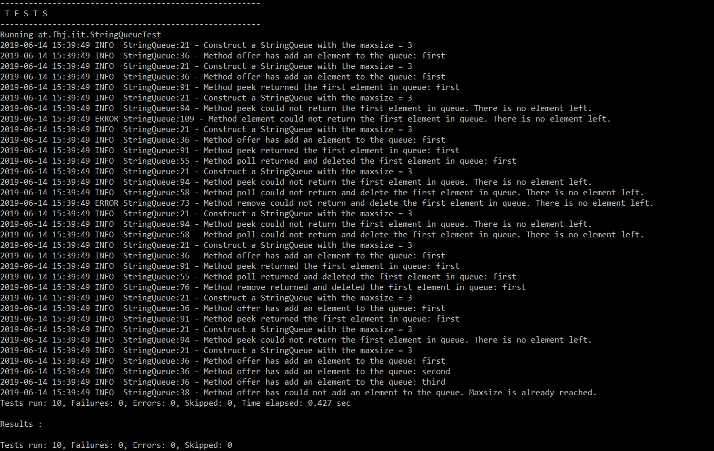
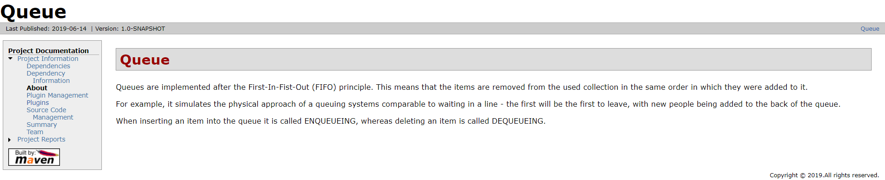

# Lab Report - Vertiefende Gesamtwiederholung
> Abgabe 04
> Laura Gröttrup | Jessica Veit

>Repository: [https://github.com/LauraGroettrup/19-Abgabe04-Groettrup-Veit.git](https://github.com/LauraGroettrup/19-Abgabe04-Groettrup-Veit.git)
 
 

## VORGEHEN
### Vorbereitung 
-   Übertragen Angabe Taskliste in das Readme des Repositories (unter Verwendung von Markdown)
-   Einspielen des Queue Vorlageprojekts aus dem Repository:  
[https://github.com/michaelulm/software-configuration-management/tree/master/test-automation/Queue](https://github.com/michaelulm/software-configuration-management/tree/master/test-automation/Queue)


## Entwicklung und Konfiguration
#### Debugging des bestehenden Codes

Folgende Fehler wurden gefunden und behoben: 
 - bla bla
 - bla
---
#### Implementation der JUnit Tests
Im gegenständlichen Projekt befindet sich eine Test Klasse `StringQueueTest.cs`, welche die Funktionalitäten der Klasse `StringQueue.cs` auf ihre richtige Ausführung überprüft.  

In der `pom.xml` muss die Abhängigkeit zur JUnit Library für den Build Prozess definiert werden, diese geschieht über den Tag `<dependency>`: 
```xml
<dependencies>
	<!-- junit Dependencies -->
	<dependency>
		<groupId>junit</groupId>
		<artifactId>junit</artifactId>
		<version>4.12</version>
		<scope>test</scope>
	</dependency>	
	...
	
</dependencies>
```



---
#### JavaDoc 
Jede Methode und Klasse wurde mit einem JavaDoc-Kommentar versehen, um anschließend im Maven Build Prozess eine API Dokumentation generieren lassen zu können. 

Ein solches Kommentar hat grundlegend folgende Form: 
```Java
/**
 * This is a textual descritpion of the purpose/function 
 * of a method or class. 
 * 
 * Also block tags can be used: 
 * @author		name of the author of the class
 * @param 		defines parameter for calling the method
 * @return		defines the value which will be return by the method
 */
```
---
#### Log4j (Version 2) 
In jeder Methode des gegenständlichen **Queue** Projektes wurden Loggging-Messages implementiert um später den Workflow der Application über die Log-Dateien nachvollziehen zu können. 

Eine solche Implementation sieht wie folgt aus: 
```java
 // Needed imports
 import org.apache.logging.log4j.LogManager;
 import org.apache.logging.log4j.Logger;
 ...
 
 // Create and initialize logging object
 private static final Logger LOG = LogManager.getLogger(StringQueue.class);
 ...
 
 // Create logging messages
 LOG.info("This is a informational log-message. ");
 LOG.error("This is a log-message documenting an error.");
```
Auch für Maven muss die Abhängigkeit zur Log4j Library bekannt gemacht werden. Zu diesem Zweck wird die `pom.xml` um diese Dependency folgendermaßen ergänzt: 
```xml
<dependencies>
	<!-- Log4j Dependencies -->
	<dependency>
		<groupId>org.apache.logging.log4j</groupId>
		<artifactId>log4j-api</artifactId>
		<version>2.11.1</version>
	</dependency>
	...
</dependencies>
```
Weiters kann Log4J auf die Bedürfnisse des jeweiligen Projektes über eine Properties-Datei angepasst werden. 
In dieser Datei können zum Beispiel
1. Output to Console
2. Output to File
3. Output to Console and File

Optionen konfiguriert werden. Dabei wird unteranderm das "Target" bestimmt (<i>Wohin sollen die Meldungen geschrieben werden?</i>)
oder auch das Layout der Meldungen definiert werden.

---
### Maven Sites 
Erforderlich Anpassung im `pom.xml` des Projektes, damit die Dokumentation generiert werden kann
(Einbindung der Plugins in den Maven Build Prozess):
```xml
<build>
    <plugins>
	    ...
		<plugin>
		    <groupId>org.apache.maven.plugins</groupId>
		    <artifactId>maven-site-plugin</artifactId>
		    <version>3.7.1</version>
		</plugin>
	</plugins>
</build>
```
Durch die Ausführung des Befehls `mvn site` in der, im project-root geöffneten Kommandozeileneingabe, wird die API Dokumentation im Ordner `..\target\site` erstellt. Die Hauptseite ist definiert als `index.html` und kann über einen beliebigen Browser geöffnet werden. 

<b>Manuelle Erstellung einer Seite</b>

Um auch eine manuell erstellte Seiten in die Dokumentation zu integrieren, muss der `src` um den folgende interne Struktur ergänzt werden: 

```
src 
│
└─── site
│   └─── apt
│       │   index.apt
│   
...
```
Hierbei kann die `index.apt` einen beliebigen Text beinhalten, welcher in **Markdown** verfasst sein sollte. 
> Im gegenständlichen Projekt wurde die Funktionsweise einer **Queue** in der Informatik beschrieben. 

Die manuell erstellte Seite ist auf der Hauptseite über den Menüpunkt **About** aufrufbar:




## Using Github Flavors
> **Übung Github Flavor**: Erstellen Sie einen Codeblock im Dokument, welcher 3 Zeilen Python und 3 Zeilen Java Source Code korrekt darstellt.

```python 
# Python: Fibonacci series up to n
>>> def fib(n):
>>>     a, b = 0, 1
>>>     while a < n:
>>>         print(a, end=' ')
>>>         a, b = b, a+b
>>>     print()
>>> fib(1000)
```    

```java
// Java: Fibonacci series 
    private int fib(int i) {
        if (i <= 0) {
            return 0;
        } else if (i == 1) {
            return 1;
        } else {
            return fib(i - 2) + fib(i - 1);
        }
    }
```    


## LINKS / LITERATUR
### Maven Sites (manual creation of sites and content)
- [https://maven.apache.org/plugins/maven-site-plugin/examples/creating-content.html](https://maven.apache.org/plugins/maven-site-plugin/examples/creating-content.html)
- [https://maven.apache.org/doxia/references/apt-format.html](https://maven.apache.org/doxia/references/apt-format.html)
### Markup Tutorials, Tips and Editors
- [https://stackedit.io](https://stackedit.io/)
- [https://www.markdownguide.org/getting-started](https://www.markdownguide.org/getting-started)
- [https://en.support.wordpress.com/markdown-quick-reference/](https://en.support.wordpress.com/markdown-quick-reference/)
- [https://support.codebasehq.com/articles/tips-tricks/syntax-highlighting-in-markdown](https://support.codebasehq.com/articles/tips-tricks/syntax-highlighting-in-markdown)
### Log4J
- [https://www.mkyong.com/logging/log4j-log4j-properties-examples/](https://www.mkyong.com/logging/log4j-log4j-properties-examples/)